# Project R: 150 Unlimited
## About

Welcome to "Project RR: 150 Unlimited"

I'm currently opening recruitment for anyone who wants to join my riding community.
Anyone can join this community. Any flags are allowed, just make sure it's 150.

_What you can do here?_

Sign up by email and get the latest news about our community
Login and share your activities with your ride, modifications, and other stuff
Join the forums and discussion, and many more
Join now, and let's burn some rubber!

## Deployment links

[projecr-r.netlify.app](https://projecr-r.netlify.app/)

[project-r.site](https://project-r.site/)

[www.project-r.site](https://www.project-r.site/)

## Website Features

We add some facilities to this playground, such as:
- Sign up and log in to make sure you are listed 
- Forums to connect to others
- Hall of Fame and Videos showing our activities
- and many more

There are many more to come, just stay tuned.
## Website Development
#### Tools
This website mainly uses three different ingredients, they are:
- HTML
- CSS
- JavaScript

#### Honorable Mention
The development of the website also involves some particular processes, such as:
- Creating branches
  
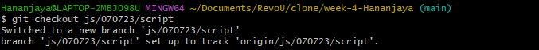

- Committing changes

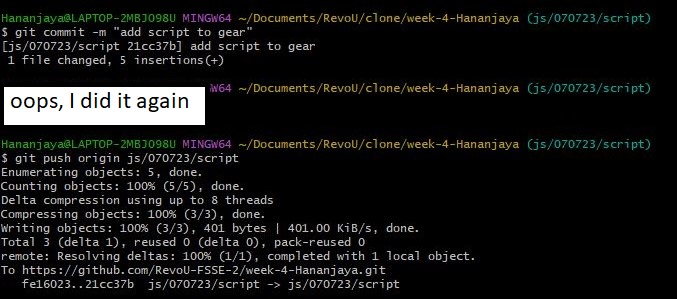
  
- Merging codes

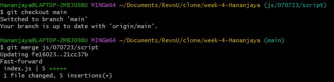

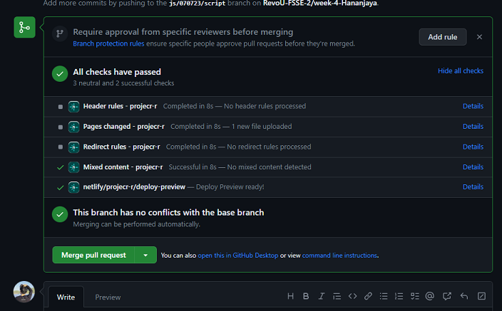

## Custom Domain and Deployment
Before we proceed to the deployment, we need to create custom domain for the website. In this case, we use Niagahoster and Cloudflare. Here is the brief description of the process:
#### Netlify

1. Go to [Netlify](https://www.netlify.com/)
2. Complete the signing process
3. Choose **Deploy with GitHub**
   
    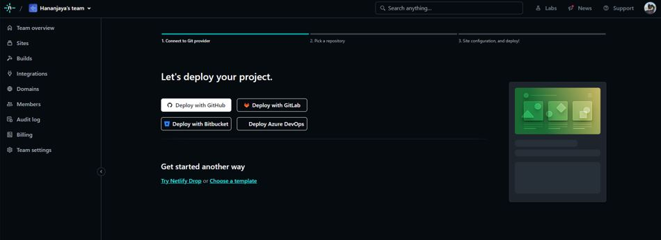

4. To add new sites, choose **import an existing project**
   
    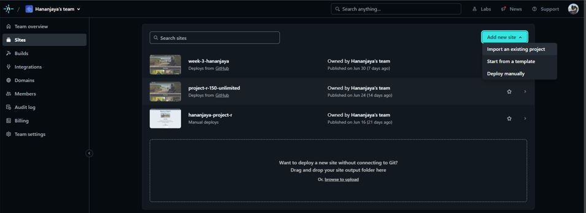

5. Select the repository you want to deploy
   
    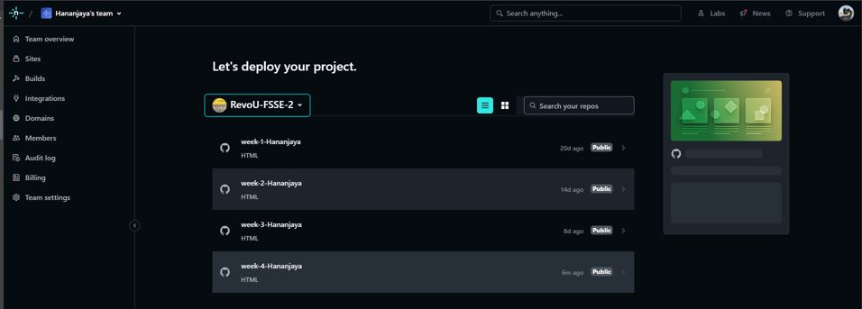

6. Customize your unique site name in **site overview** > **Domain settings**
   
    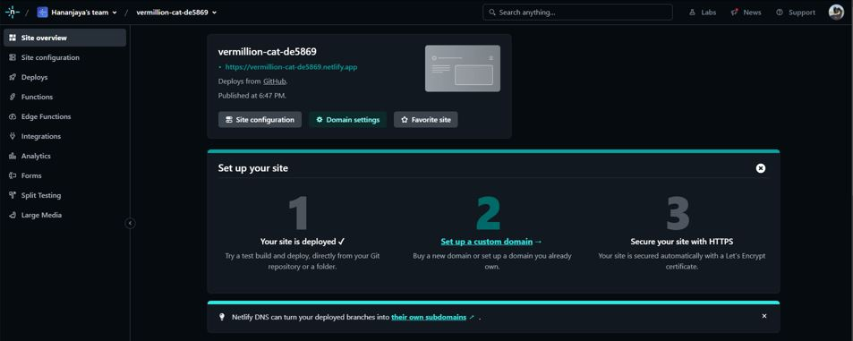

7. You are good to go!
   
    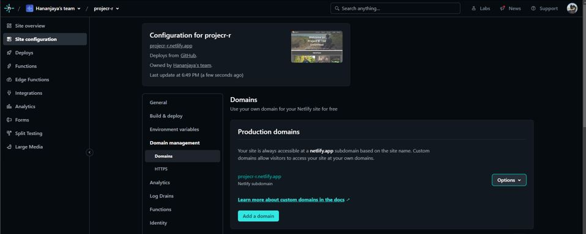

#### Niagahoster
1. Go to [Niagahoster](https://www.niagahoster.co.id/)
2. Complete the signing process
3. Check the availability of your unique custom site name
4. Choose the payment method and complete the payment process
5. you should be redirected to this page, wait for the status to be updated to **active**
   
    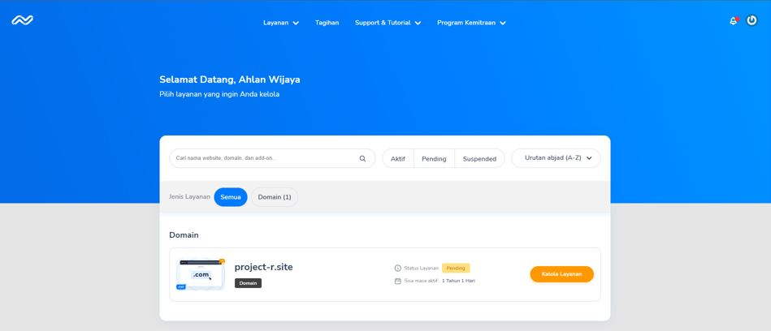
6. Proceed to the next step, setting up the Cloudflare

#### Cloudflare
1. Go to [Cloudflare](https://www.cloudflare.com)
2. Complete the signing process
3. Add your unique custom site you just brought from Niagahoster
   
    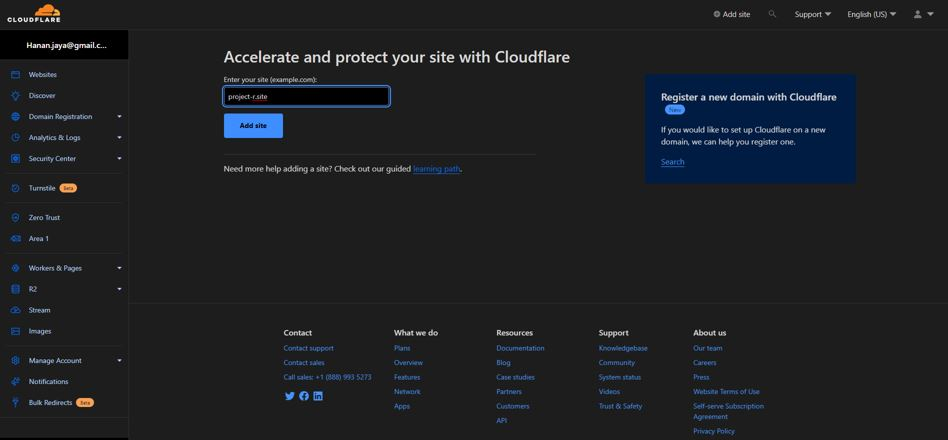
   
4. Choose your subscription plan
   
    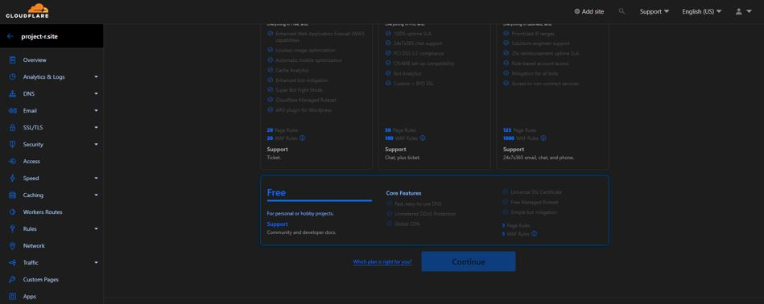

5. Go to **DNS** > **Record** > **Cloudflare Nameservers**, copy the Nameservers 
   
    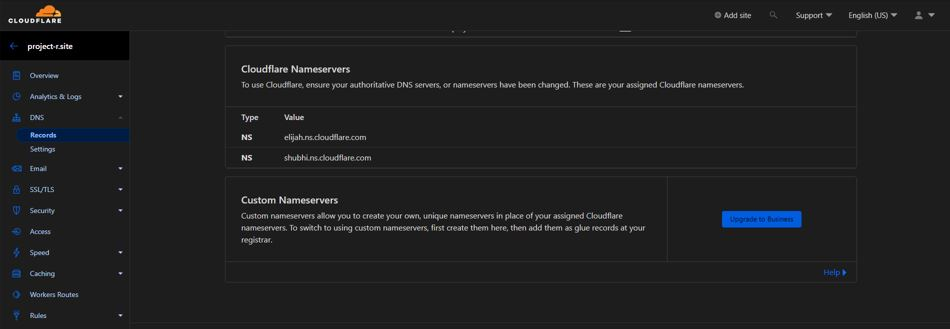

6. Go back to Niagahoster, replace the nameservers with the ones provided by Cloudflare
   
    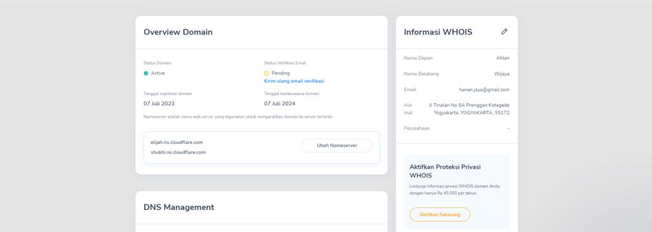

7.  In DNS Record, add record by choosing the type, Name, and Target.
   
    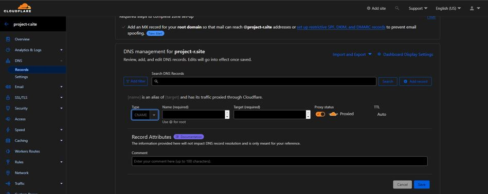

8.  The result will be:
   
    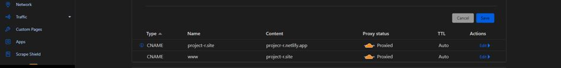

9.  Go to Netlify, choose **Add a Domain** in Domain management.
    
    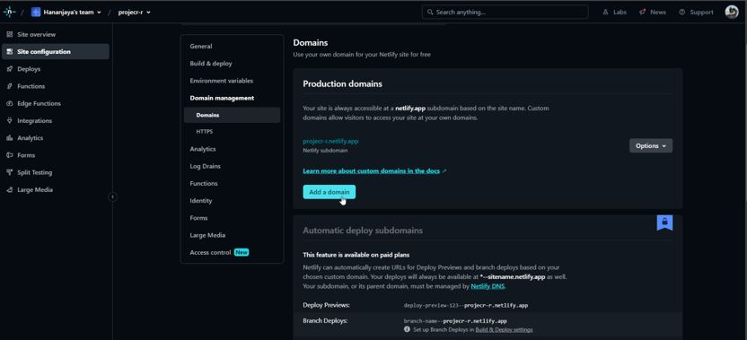

10. Complete the process
    
    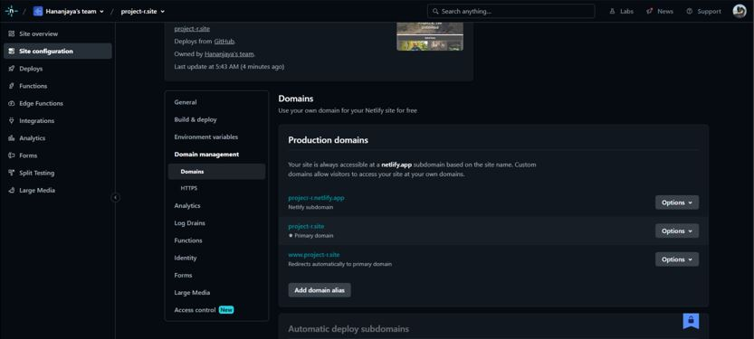

11. Finish, _salam luar biasa_